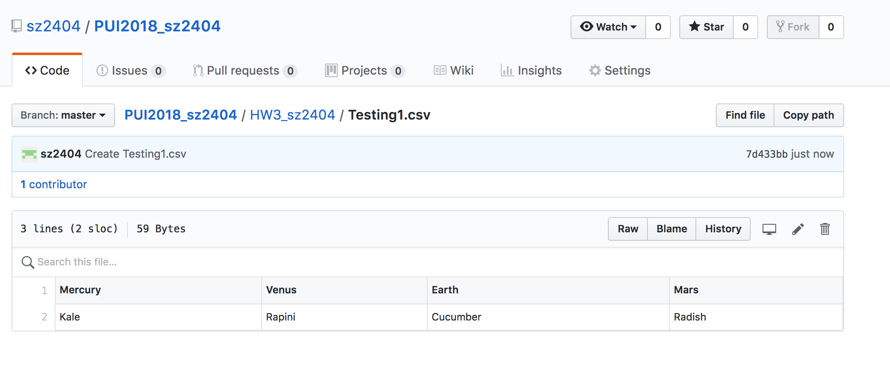

# Homework 2 - Part 1
Perform the instruction in deleteData.md: delete data and its history from a GitHub repo.
I created a random txt file called Testing1. txt. Then I followed Dr. Bianco's lab (found here: https://github.com/fedhere/PUI2018_fb55/blob/master/HW3_fb55/deleteData.md) to force delete the file and it's traces in the history. 

Here's the screenshot of the file I created:

Here's the commands I used in the terminal for erasing the file and the history:

# Homework 2 - Part 2
In this section, I am using the Tonnage Data collected by DSNY. 

I mostly followed Professor Bianco's commands from the Assignment2_example (https://github.com/fedhere/PUI2018_fb55/blob/master/HW3_fb55/Assignment2_example.ipynb). 

Regarding displaying columns and displaying top rows etc. For dropping columns, I used the drop() command. 

# Homework 2 - Extra Credit
The reading JSON part, I followed Professor Bianco's instruction, obtained the link from SODA API for the JSON file then used the pandas JSON reading function to structure the datafram. 

The plotting date against another number part, I sticked to the tonnage data and displayed the monthly recycled paper weight. 

# Homework 2 - Part 3
For this part, I used the try and except statements twice:
1. Some Select Bus Lines (possibly services interruption) have different data structure or no data. The first try and except statements are trying to seperate the different outputs for regular running buses and some interrupted service (for example, M34, M23). 
2. Sometimes, there will be no information for the location as buses are possibly not running. The second try and except statements are set up under the 'for loop' to distinguise buses that have valid location data versus not. 

# Homework 2 - Part 4
For this part, I built in based on the existing code I wrote in Part 3. 

# Collaboration Statemnet:
Specials thanks to Ilyas Habeeb and Te Du:

I consulted Te Du (a previous CUSP student) to explain the for loop and how to use the Try and Except within it.

I discussed certain functions, i.e. if statement, with TA Ilyas Habeeb. Ilyas also explained the rotation for ticks in plotting function as well the instructions for the Extra Credit section. Ilyas also mentioned to me that the py script should cover situations where bus data is not available following running bus format. 

# Other Links Refered:
For printing information on csv, I used fout.writelines functions: http://www.pitt.edu/~naraehan/python2/reading_writing_methods.html

For figure size setting, I refered to this link: 
https://matplotlib.org/api/_as_gen/matplotlib.figure.Figure.html

For making a list/tuples into a string through the join() function, I referred to this link:
https://www.quora.com/In-Python-how-do-you-convert-a-list-to-a-string

