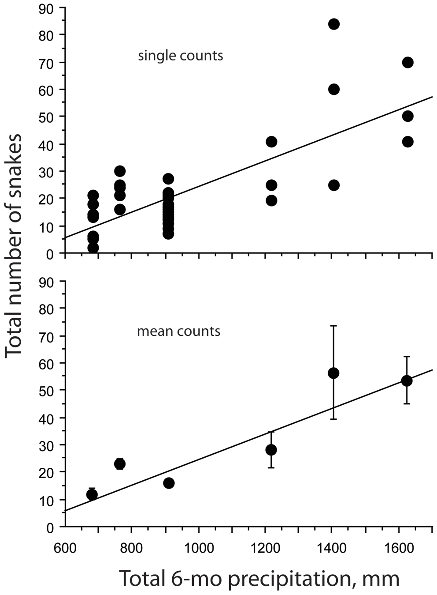

# Part 2 - Literature and Statistical Anlysis Methods

|**Statistical Analyses**	|  **IV(s)**  |  **IV type(s)** |  **DV(s)**  |  **DV type(s)**  |  **Control Var** | **Control Var type**  | **Question to be answered** | **_H0_** | **Alpha** | **link to paper**| 
|:----------:|:----------|:------------|:-------------|:-------------|:------------|:------------- |:------------------|:----:|:-------:|:-------|
Correlation	| Total numbers of sea kraits (snake) counted on different nights during June/July | Counts | Cumulative precipitation during the previous six months| Interval | N.A | N.A | 	Does the number of sea kraits within the research area correlates with precipitation level  | Number of snakes found during high precipitation  <= Number of snakes found during low precipitation | 0.001 | [Abundance of Sea Kraits Correlates with Precipitation](https://journals.plos.org/plosone/article?id=10.1371/journal.pone.0028556) | 

### Major plot for literature selected for Correlation: 

### Major plot for literature selected for ANOVA:

### Major plot for literature selected Logistic Regression:

