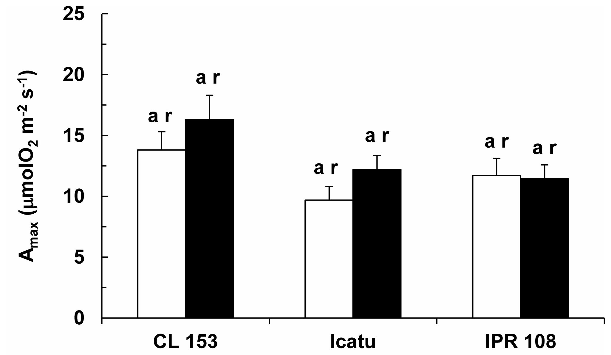
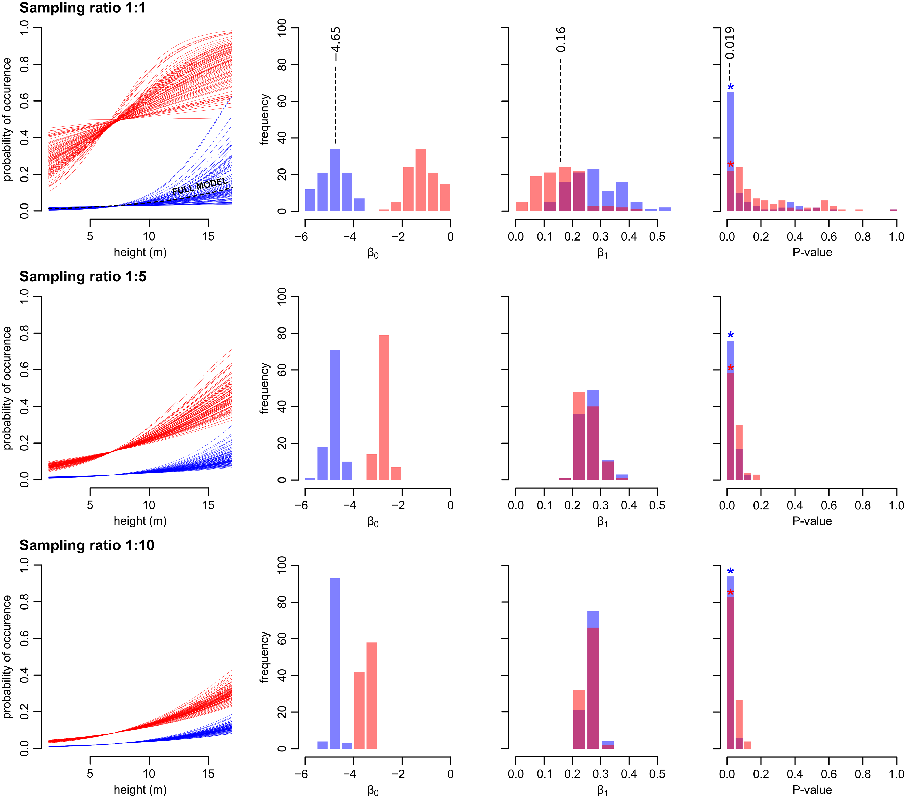

# Part 2 - Literature and Statistical Anlysis Methods

### Summary Table

|**Statistical Analyses**	|  **IV(s)**  |  **IV type(s)** |  **DV(s)**  |  **DV type(s)**  |  **Control Var** | **Control Var type**  | **Question to be answered** | **_H0_** | **Alpha** | **link to paper**| 
|:----------:|:----------|:------------|:-------------|:-------------|:------------|:------------- |:------------------|:----:|:-------:|:-------|
Correlation| Cumulative precipitation during the previous six months | Interval | Total numbers of sea kraits (snake) counted on different nights during June/July| Counts | N.A | N.A | 	Does the number of sea kraits within the research area correlates with precipitation level  | Number of snakes found during high precipitation  <= Number of snakes found during low precipitation | 0.001 | [Abundance of Sea Kraits Correlates with Precipitation](https://journals.plos.org/plosone/article?id=10.1371/journal.pone.0028556) | 
ANOVA	| 3 different genotypes under different CO2 treatments | Categorical | Photosynthetic Capacity (Amax)| Intervals | CO2 concentration level (or this can be considered part of IV characteristics) | Interval | 	Does Long-Term Enhanced CO2 level affect the photosynthetic performance of Coffea spp.   |  Photosynthesis performance with low concentration CO2 treatment  <= Photosynthesis performance with high concentration CO2 treatment | 0.05 | [Sustained Photosynthetic Performance of Coffea spp. under Long-Term Enhanced [CO2]](https://journals.plos.org/plosone/article?id=10.1371/journal.pone.0082712) | 
Logistic Regression	| The height of the roosting cavity (for bats) | Interval | Probability of bat Occurance | Dichotomous | N.A | N.A | 	Does the height of roosting cavity have impacts on bat occurance  |  Bat occurance at higher roosting cavity height  <= Bat occurance at lower roosting cavity height | 0.05 | [Why sampling ratio matters: Logistic regression and studies of habitat use](https://journals.plos.org/plosone/article?id=10.1371/journal.pone.0200742) | 
### Major plot for literature selected for Correlation: 

### Major plot for literature selected for ANOVA:

### Major plot for literature selected Logistic Regression:

### Collaboration:
I worked with Chang (Angel) Liu on this part together searching for literature in PLOS One. We decided on the statistical analysis method that we both interested in and search for a few potential journals. We reviewed the abstracts, relevant figures, and figure explanations together. 

### Notes:
Each selected journal contained other plots and tables that used statistical analysis. Only the one that more directly speaks about the result has been included. 

### Reference for picture formatting in md files:
https://stackoverflow.com/questions/14675913/changing-image-size-in-markdown

