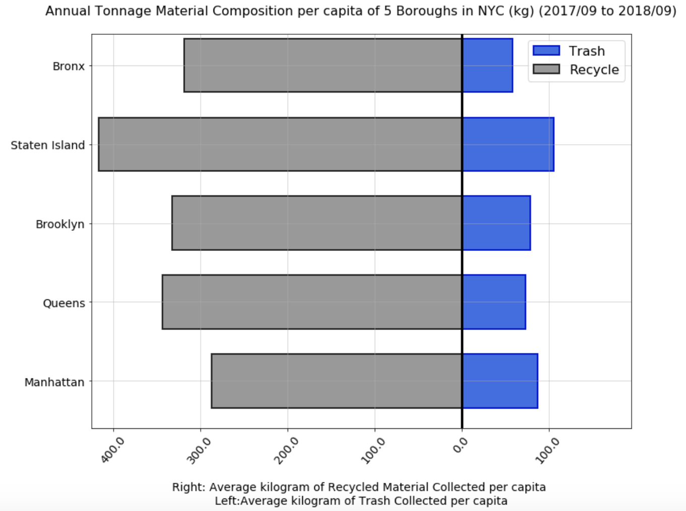

Clarity: The plot is a little confusing to me because the legend directly contradicts what is written in the caption. The plot is showing that much more waste is recycled each year as compared to the trash but the caption says that the trash is much higher. In addition to that, the y-axis is missing the axis label. This made the graph a little difficult to understand for me. But, the caption was actually quite descriptive and clear and it contained all the information the graph was trying to get through. 

Esthetic: I think choosing the bar chart was a wise option for the information the graph wanted to display. But, plotting the bars vertically as discussed in class, would have made them a little easier to understand for the viewers. Also, splitting the bar chart into 2 pieces was unnecessary. The same could have been better projected by just plotting one on top of another and choosing appropriate colors such that the recycled quantity, which is lower than the trash(according to the caption) would still be easily visible. I think representing the trash by a dark and negative color and the recycling by a 

Honesty: The plot is representing the data as it is without deforming or misusing it to emphasize a point.

Link to the actual plot is: https://github.com/SohamMody/PUI2018_sz2404/tree/master/HW8_sz2404
